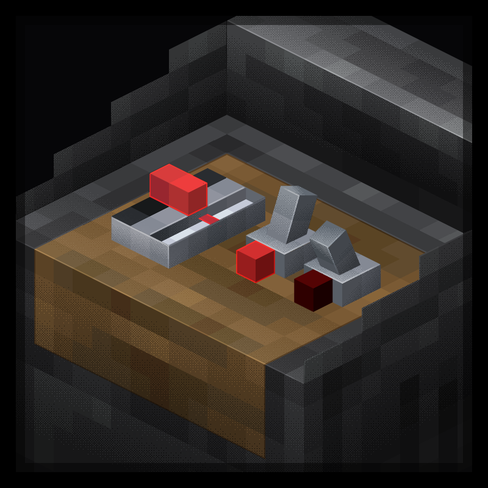

<p align="center"></p>
<h1 align="center">Dashpanels
<br>
<div align="center">
    <a href="https://discord.gg/kk7GaBcBgh">
        
    </a>
    <a href="https://modrinth.com/mod/dashpanels">
        
    </a>
    <a href="https://www.curseforge.com/minecraft/mc-mods/dashpanels">
                
    </a>
</div>
</h1>

<p>Mod for modular control panels for more compact redstone</p>

## DISCLAIMER:
### This mod if very indev and is made by one mediocre modder, report any bugs to https://github.com/BoxxedDev/control-panels/issues

---

### Compat list
| mod           | status                                                                                           |
|---------------|--------------------------------------------------------------------------------------------------|
| ComputerCraft | [:white_check_mark:](https://github.com/BoxxedDev/control-panels/wiki/ComputerCraft-Integration) |
| Create        | :white_check_mark:                                                                               |
| Sable         | :white_check_mark:                                                                               |
| Dye Depot     | :white_check_mark:                                                                               |

---

### Roadmap

<details>
<summary>Data packs</summary>
Eventually add the ability to make custom moduletypes using datapacks
<br>
<br>
A json for a custom module type could look something like this:

```json
{
  "base_type": "input",
  "custom_values": [
    {
      "name": "state",
      "type": "boolean"
    }
  ],
  "renderer": "[some molang expression]"
}
```
</details>

<details>
<summary>More modules</summary>
<ul>
<li>Terminal Keyboard
<li>Terminal Screen
</ul>
</details>

<details>
<summary>Fabric</summary>
        Version 3 will hopefully have multiloader, may be a month or two until then from 6/8/26
</details>

---

#### Started May 10th, 2026
